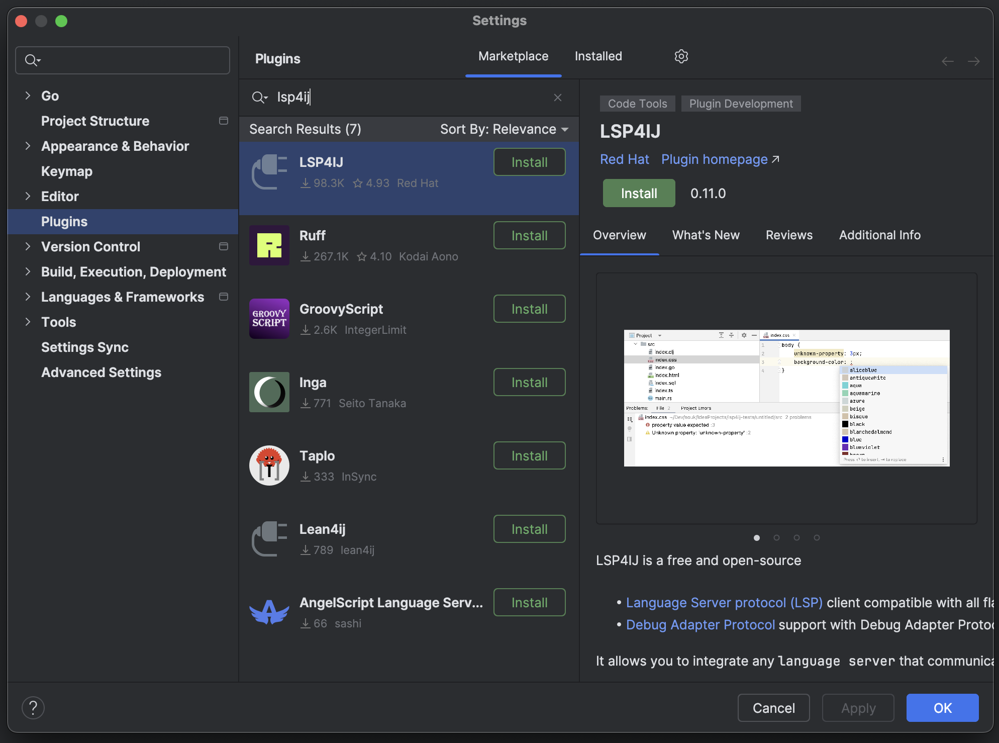
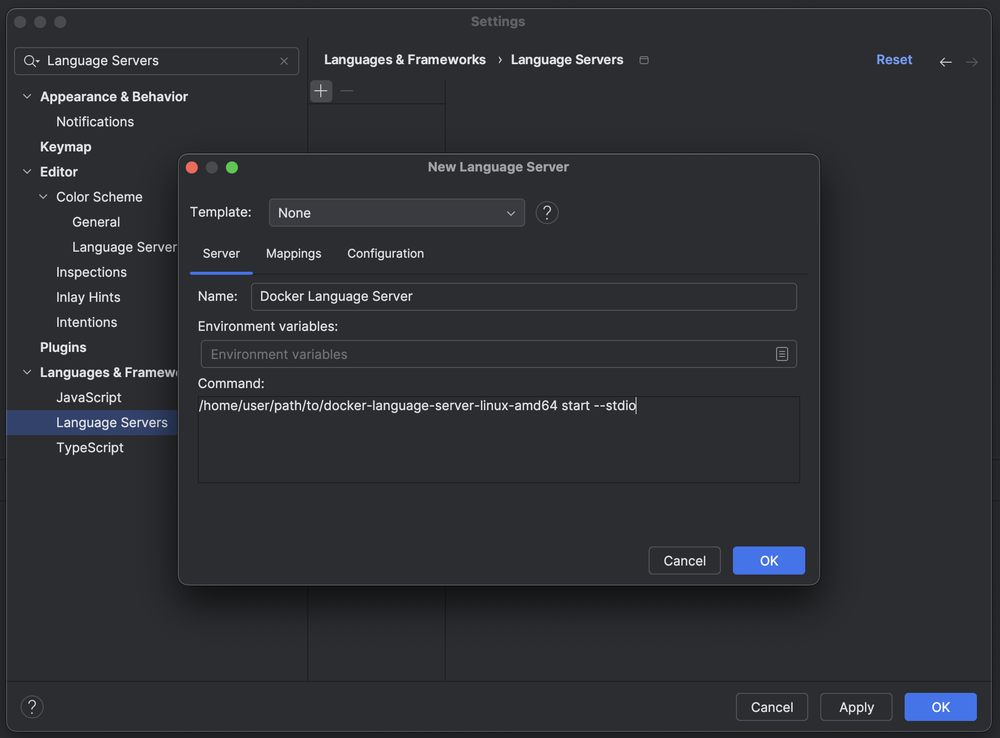
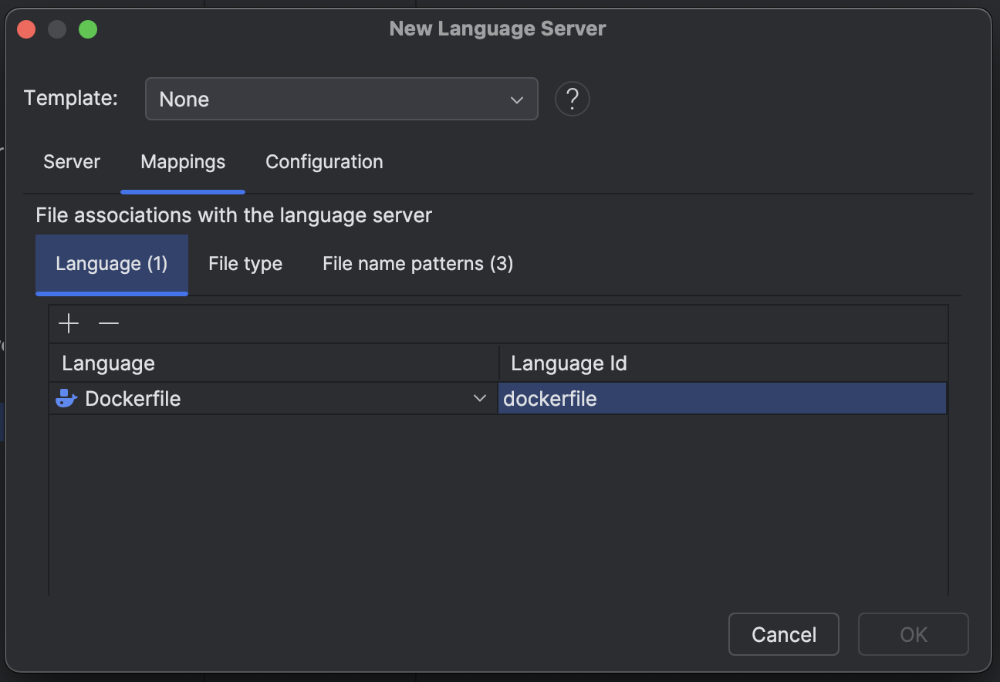
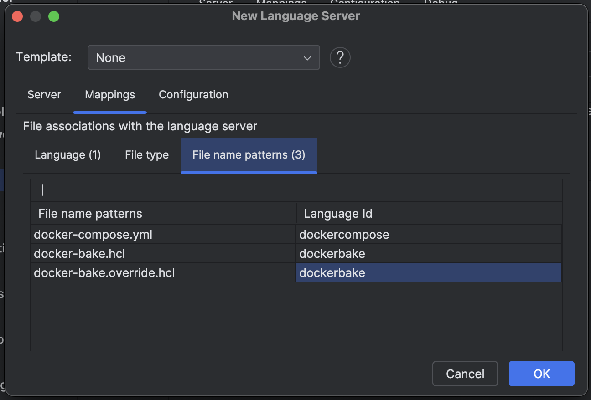
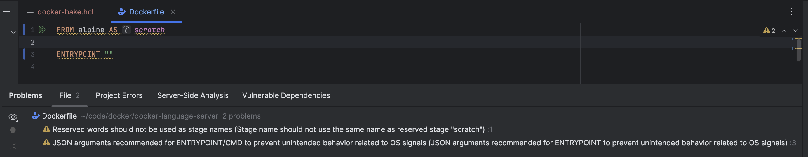
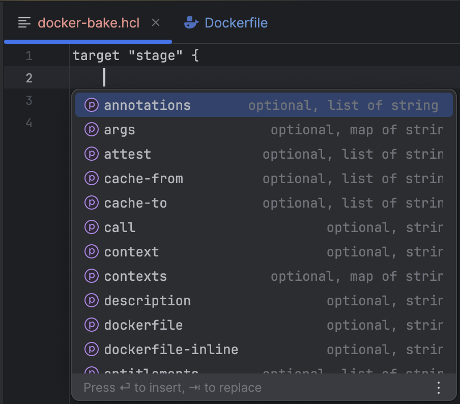

# Language Clients

The Docker Language Server can be plugged into any editor that supports the [Language Server Protocol](https://microsoft.github.io/language-server-protocol/). If you have successfully configured the Docker Language Server with an editor that is not mentioned here, please document the steps and then open a pull request. We would be happy to review your steps and add it to the list below!

## Maintained Clients

### Visual Studio Code

The Docker Language Server maintains and develops the Docker DX ([Visual Studio Code extension](https://marketplace.visualstudio.com/items?itemName=docker.docker)).

## Other Clients

### JetBrains

To connect a JetBrains IDE with the Docker Language Server, we will be using [LSP4IJ](https://github.com/redhat-developer/lsp4ij) from Red Hat. It is an open source LSP client for JetBrains IDEs.

Before you begin, download the language server binary for your platform from [our builds](https://github.com/docker/docker-language-server/actions). Then, open your JetBrains IDE and find "Plugins" in the "Settings" dialog window. Go to the "Marketplace" and then search for "lsp4ij" from Red Hat. Install the plugin and then restart your IDE.

Open the "Settings" dialog window and search for "Language Servers" this time. Select the "Language Servers" under "Languages & Frameworks" and then click the + sign and another dialog window will appear.

Name the configuration "Docker Language Server" and under "Command:" add the path to your language server binary and then append `start --stdio` at the end.

Navigate to the "Mappings" page and add one row to "Language" as depicted below.

Go to "File name patterns" and then add the three rows depicted below.

Click "OK" to save the configuration. You have now successfully configured the Docker Language Server with LSP4IJ for your JetBrains IDE! Don't forget to make sure you have a Docker engine running.

