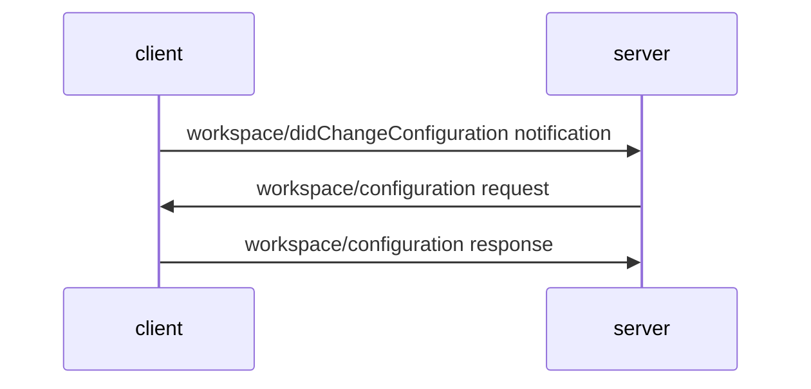

# Telemetry

The Docker Language Server collects telemetry and telemetry collection is **disabled** by default. We collect this telemetry so that we can improve the language server by understanding usage patterns and catching crashes and errors for diagnostic purposes.

## Configuring Telemetry Collection

There are three different telemetry settings in the Docker Language Server.

- `"all"` - all telemetry will be sent
- `"error"` - send only errors and crash information
- `"off"` - do not send any telemetry

This configuration can be set in two different ways.

### Initialization

You can include the desired telemetry setting for the language server when sending the initialize `initialize` request from the client to the server. If you include a `telemetry` property inside the `initializationOptions` object in your `initialize` request then the language server will be initialized as such.

```JSONC
{
  "clientInfo": {
      "name": "clientName",
      "version": "1.2.3"
  },
  "initializationOptions": {
    // you can send enable all telemetry, only send errors, or disable it completely
    "telemetry": "all" | "error" | "off"
  }
}
```

### Dynamic Configuration

If you want to allow your users to configure their telemetry settings whenever they want, then the client needs to send a `workspace/didChangeConfiguration` to the server notifying it that the `docker.lsp.telemetry` configuration has changed. The server will then send a `workspace/configuration` request to the client asking the client to respond back with what setting (`"all" | "error" | "off"`) should be used.



## Telemetry Data Collected

- name and version of the client
- action id that was executed for resolving a diagnostic
- name of the function that triggered a crash
- stack trace of a crash
- hash of the Git remote of modified files
- hash of the path of modified files

## Privacy Policy

Read our [privacy policy](https://www.docker.com/legal/docker-privacy-policy/) to learn more about how the information is collected and used.
